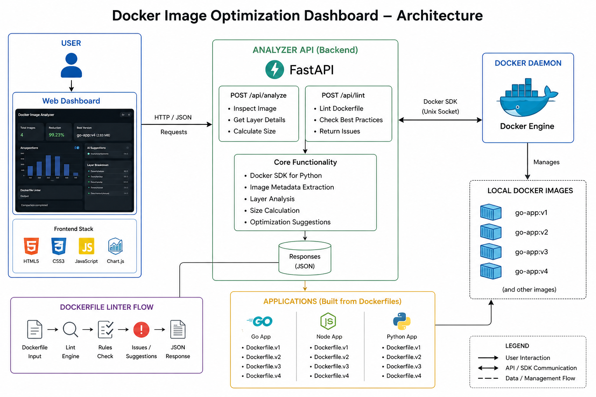

# 🐳 Docker Image Optimization Analyzer

A full-stack DevOps tool that analyzes Docker images, detects inefficiencies, and provides optimization recommendations through an interactive dashboard.

---

## 📌 Project Overview

The **Docker Image Optimization Analyzer** helps developers:

* Understand Docker image structure
* Identify large and inefficient layers
* Compare multiple Dockerfile versions (V1 → V4)
* Optimize image size using best practices
* Visualize improvements through charts

---

## 🏗️ Architecture

<p align="center">
  
</p>

### 🔹 Workflow

1. User enters image name in Dashboard
2. Frontend sends request → FastAPI backend
3. Backend uses Docker SDK to inspect image
4. Docker Engine returns image metadata
5. Backend processes:

   * Layers
   * Sizes
   * Optimization insights
6. Frontend displays:

   * Charts
   * Metrics
   * Layer breakdown
   * Suggestions

---

## ❗ Problem Statement

Docker images often become **large and inefficient** due to:

* Heavy base images (golang, node)
* Poor Dockerfile practices
* Too many layers
* No cleanup or optimization

### 🔻 Impact

* Slow deployments
* High storage usage
* Increased network transfer time

---

## ✅ Solution

This tool provides:

✔ Image analysis
✔ Layer breakdown
✔ Optimization suggestions
✔ Version comparison
✔ Visualization dashboard

---

## 🚀 Features

### 🔍 Image Analysis

* Total image size
* Number of layers
* Largest layers

---

### 📊 Comparison Dashboard

* Compare multiple versions (V1 → V4)
* Bar chart visualization
* Displays:

  * Size reduction %
  * Best optimized version

---

### 📦 Layer Breakdown

* Shows meaningful layers only:

  * RUN
  * COPY
  * WORKDIR
  * CMD
* Filters base image noise
* Displays size per layer

---

### ⚡ AI Optimization Suggestions

Rule-based intelligent system:

Detects:

* Large base images
* Too many layers
* Inefficient COPY usage

Suggests:

* Multi-stage builds
* Alpine / Distroless images
* Layer optimization

---

### 🧪 Dockerfile Linter

Detects:

* Use of `ADD` instead of `COPY`
* Missing cleanup
* Inefficient commands

---

### 🌗 Theme Support

* Light / Dark mode toggle

---

## 🐳 Optimization Results

| Version | Size    |
| ------- | ------- |
| V1      | 1102 MB |
| V2      | ~94 MB  |
| V3      | ~13 MB  |
| V4      | ~11 MB  |

### 📉 Final Reduction

**~99% image size reduction**

---

## 📁 Project Structure

```
docker-analyzer/
│
├── analyzer_tool/
│   ├── main.py
│   ├── Dockerfile
│   ├── requirements.txt
│
├── dashboard/
│   ├── index.html
│   ├── style.css
│   ├── script.js
│
├── apps/
│   ├── go-app/
│   ├── node-app/
│   ├── python-app/
│
├── docs/
│   └── architecture.png
│
├── docker-compose.yml
├── README.md
```

---

## ⚙️ Setup & Run

### 1️⃣ Clone Repository

```bash
git clone <your-repo-url>
cd docker-analyzer
```

---

### 2️⃣ Run Using Docker (Recommended)

```bash
docker-compose up --build
```

---

## 🌐 Access

* Dashboard → http://localhost:3000
* API Docs → http://localhost:8000/docs

---

## 🧪 Usage

1. Enter image name (e.g., `go-app:v1`)
2. Click **Analyze**
3. Click **Compare All**
4. View:

   * Chart comparison
   * Reduction %
   * Best version
   * Layer breakdown

---

## 🛠️ Tech Stack

* Backend → FastAPI, Docker SDK (Python)
* Frontend → HTML, CSS, JavaScript, Chart.js
* DevOps → Docker, Docker Compose
* AI → Rule-based optimization engine

---

## 🔧 Optimization Techniques Used

* Multi-stage builds
* Distroless base images
* Layer caching optimization
* Dependency reduction
* Binary stripping

---

## 🎯 Use Cases

* DevOps optimization
* CI/CD pipelines
* Docker debugging
* Performance tuning

---

## 👨‍💻 Author

**Lahari Sri**
B.Tech CSE | DevOps & Cloud Enthusiast
